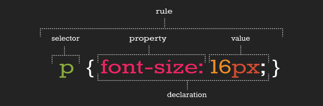
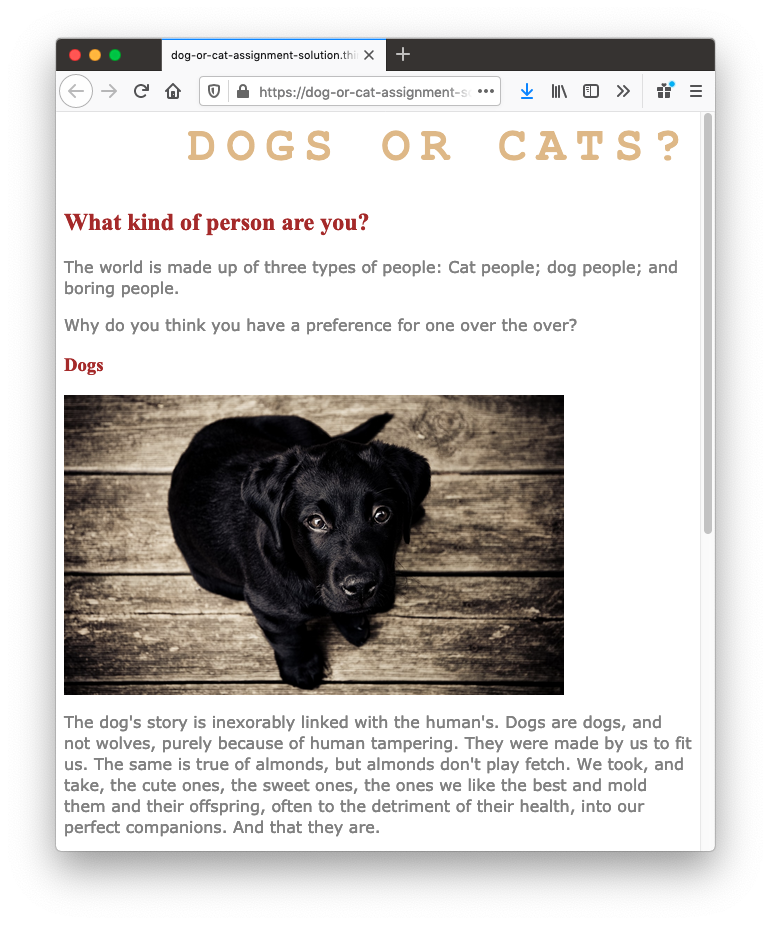

## **Intro to CSS styles**

As you've learned, HTML is actually pretty boring on its own. That's where CSS comes in. CSS styles and formats HTML text, allowing it to display in various fonts, sizes, and colors on web pages. Although CSS was specifically designed to complement HTML, CSS code is usually written in distinct files, with filenames like **style.css**. This separation helps keep the HTML code and CSS code organised. This video will explain a bit more.

Back again with Aaron Jack to give a quick overview on what CSS is

<iframe width="560" height="315" src="https://www.youtube.com/embed/Z4pCqK-V_Wo" frameborder="0" allowfullscreen></iframe>

### **Demo: Text styles**

This demo showcases how CSS styles can be added to HTML headings and paragraphs. As you review the code in the [Repl.it](http://repl.it/) below, take a moment to answer these questions.

- What does the first line of code do in the HTML?
- What happens if the first line of code in the HTML is deleted?
- Is there anything in the **.css** file that seems to relate to what's in the **.html** file? What possible connections or similarities do you recognise?

Now that you've played around a bit on your own, it's time to investigate further. As you may have noticed, the two files—the .html file and the **.css** file—need to be connected. To connect the files, the HTML page needs to refer to the **.css** file like this:

```html
link href="style.css" rel="stylesheet" type="text/css";
```

Here, the HTML code is linked to the **style.css** file that is in the same folder as the **.html** file. But you'll learn more about this line of code later. For now, you just need this key information. This is how you'll connect the CSS code to the HTML code.

---

## **CSS rulesets**

Like HTML, CSS has a particular syntax. To properly follow this syntax, you'll need to learn how it works.

CSS is a collection of _rulesets_, which are commonly referred to as _rules_. These rules define what changes are applied to the HTML file. This image shows a single rule, which has several components: a selector, a property, a declaration, and a value.


Here's a quick rundown based on the image above. This will give you a high-level overview before you dive deeper.

- **Rule or ruleset**: This is the entire block of CSS code assigned to style an HTML element.
- **Selector**: This is the name of the HTML element that will be styled.
- **Property**: This is a set or family of attributes, or options, that you can change.
- **Value**: This is the specific change you want to make, such as pixel size, color, etc.
- **Declaration**: This consists of both the property and the value assigned to the selector.

### **Selectors and declarations**

A **_selector_** defines what element in the code should be affected by the _declaration block_ that follows the selector. The selector refers to a specific HTML element, like a p element in the image above. In this case, every p element, or HTML paragraph, on the page will be styled by the information provided in the declaration block.

The **declaration** block begins and ends with curly brackets {}. Each line inside of the {} represents a separate _declaration_, each of which applies a particular style or format to the referenced element. For example, the CSS code below has two declarations. What does each one do?

```css
p {
  color: blue;
  font-size: 16px;
}
```

### **Properties and values**

Each declaration is made up of two components: a _property_ and a _value_. At its most basic level, a CSS property is the general category or type of stylistic change you'd like to make. The value then specifies _exactly_ what style you'd like to apply.

There are hundreds of CSS properties and values. The [CSS Properties Reference](https://developer.mozilla.org/en-US/docs/Web/CSS/CSS_Properties_Reference) from Mozilla is a valuable resource that shares only the most common properties. And as you'll see, it's still a long list! In fact, you will regularly discover new CSS properties and values over the course of your career.

In a declaration, the property is named first. It's followed by a colon :, then the value, and then a semicolon ; at the end. Structurally, declarations look like this: property: value;. One of the best ways to learn about properties and values is to see examples of how they work. Check out the one below. What do these declarations do?

```css
h1 {
  color: white;
  font-family: "Times New Roman";
  font-size: 16px;
}
```

As you might've guessed, the **color** property refers to text color, and the value **white** sets the color of the text to white. (It's worth noting that you'll often see hex color codes in the value position, but you'll learn about those later on.) The **font-family** applies a specific font to the text. Arial and Times New Roman are both common fonts found on nearly every computer. Font names with more than one word are wrapped in quotes, like **'this'**, to help the code read the font name properly.

The **font-size** property refers to how big or small the text will be on the page. The px value stands for pixels, and it sets the exact text size. Pixels are a common measurement for text on the web. But as you learn more about sizing, you'll discover other measurements that are particularly useful in sizing HTML elements.

---

### **Drill: Text-styling practice**

In the [Repl.it](http://repl.it/) provided, fork the code and update the presentation of the HTML text using CSS. Specifically, try to match the target samples below by applying the CSS appropriate properties and values to the HTML headings and paragraphs.

Once you've matched the target samples with your code samples, practice using different values to change the presentation of the HTML web page. The following are sample values that may be useful.

- **color**

  - red
  - blue
  - green
  - pink
  - yellow
  - orange
  - black

- **font-family**

  - Arial
  - 'Arial Black'
  - 'Comic Sans MS'
  - Impact
  - 'Trebuchet MS'
  - 'Times New Roman'
  - Georgia
  - Webdings
  - Wingdings

- **font-size**

  - Practice using sizes that are between 8px and 108px.

**Practice target #1**

**Practice target #2**

---

## **Intro to web colors**

In the very early years of HTML, _color names_, like white above, were assigned to a limited number of color values. These color names are still in use, and they have the benefit of being fairly easy to remember and reference. But there's a major constraint: there are only 140 of them. Fortunately, there's now a solution to that problem: hex color codes.

Today, the far more robust and professional way of assigning colors is to use _hex color codes_ (which are sometimes called _hex values_). Hex color codes tend to be less "friendly" than color names because they are represented by an alphanumeric code rather than a familiar word. For instance, the orange-red color name of _tomato_ is far easier to remember than _#FF6347_.

However, hex color codes have expanded the internet's color palette considerably. There are now 16,777,216 possible color values for you to use, which is much more than 140. It's worth noting that when you do assign color values, you do not need to assign both a color name and hex color code. You just need to use one.

You should also check out this list of [color names and hex color codes](https://htmlcolorcodes.com/color-names/) to see all 140 named colors and their corresponding hex color codes. Although you'll likely use hex color codes in your everyday work, it's useful to become familiar with the color names in case you work with developers that use color names as a shortcut in assigning color values.

### **Finding color values**

Hex color codes may be a little harder to recall, but the truth is this: you actually don't need to remember them. There are several ways to find hex color codes on the web when you need them, including many useful tools, plugins, and websites.

One useful tool is called [Coolors](https://coolors.co/). With a single click, Coolors will generate a color scheme for you to use. These colors, in combination with shades of white and black, will be more than sufficient for your work in this module.

With that said, there are really only two hex color codes that you should memorize. Fortunately, they're fairly straightforward:

- **Black**: The hex color code for black is #000000.
- **White**: The hex color code for white is #ffffff.

---

## **More on fonts: Fallbacks**

As you saw above, the font-family property assigns a particular font to HTML text. This capability allows to design written content on a web page using specific typefaces.

However, you may see declarations in which the font-family property is followed by more than one font value. Check out the example below.

```css
h1 {
  font-family: Arial, Tahoma, serif;
}
```

This coding concept is referred to as _font stacks_, and it helps prevent issues if a computer or browser can't assign the requested font to the specified text. The font stack tells the code that if the first font—in this case, **Arial**—doesn't load properly, it should try the next font in the list. The code will try each font until it finds one that works properly. These are called _font fallbacks_.

Generally, the last font choice should be a general category of typeface that every device can work with. It likely won't be another specific font, but a broader type of font style, like serif or sans-serif. All of the following font categories will reliably show up on every machine, and can therefore be used at the end of your font stack.

- **Serif**: Serif fonts are often used for headings. The letters in these fonts have little tapered ends or tails, which add a stylistic accent to text and make letters and characters more attractive at larger sizes.
- **Sans-serif**: Sans-serif fonts are often used for paragraph text on websites. They have minimal flaring or tapering at the ends of letters, making smaller text easier to read.
- **Monospace**: These fonts are often used for code samples, and all of the letters have the same width.
- **Cursive**: This type of font has a playful, handwritten style, which can feel more emphatic than italics.
- **Fantasy**: This type of font has a whimsical, decorative style. But use this as a fallback with care; it's more limited than other font groups.

## **More styles for text**

As you explore CSS further, you'll likely want to play around with other text-related properties. Here are just some fun examples:

- **font-style:** This is how you can change the stylistic formatting of the font, such as adding italics (italic or oblique).
- **font-weight**: This is how you set the thinness or thickness of a font. There are usually values from 100 to 900 available.
- **letter-spacing**: This is how you determine the proximity of individual letters by increasing or decreasing the space between them, measured in pixels. For instance, a value of 1px is fairly normal, or a value of -3px will pull the letters closer together.
- **line-height**: This is how you increase or decrease the space between lines of text. For instance, you could apply 20px of space between lines of text.
- **text-align**: This property allows you to realign text to be center, left, right, or justified.
- **text-decoration**: This allows you to add additional formatting, like underline, overline (text with a horizontal line above it, often used in math notation), or line-through (also known as strikethrough).
- **text-transform**: This allows you to change the case of the letters, such as uppercase and lowercase.

---

## **Practice**

For this assignment, you will be styling the _Dogs or Cats?_ web page shown in the image below.


1.  Use CSS code to style the HTML page in the [Repl.it](http://repl.it/) below. Your goal is to make your web page look as much like the image as possible. But don't stress too much about getting the colors or sizes exactly right. Just do your best.

### **Put your version of the website in the comments. Don't be shy in showing the world. Everyone started with small steps 😇**
